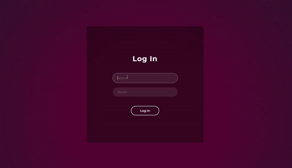
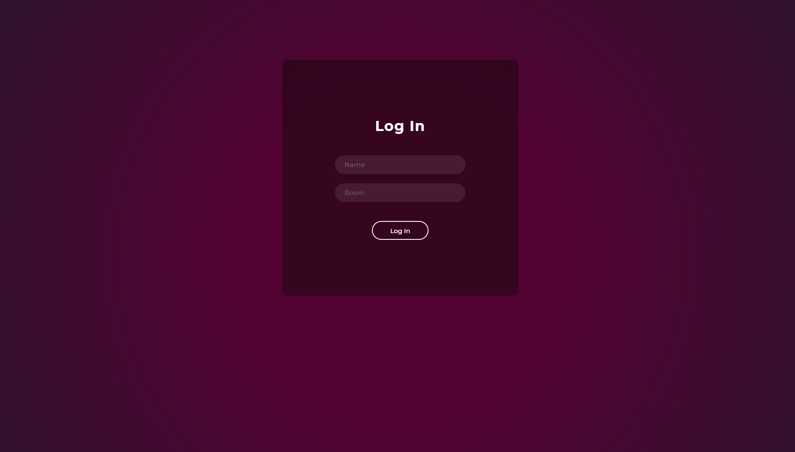
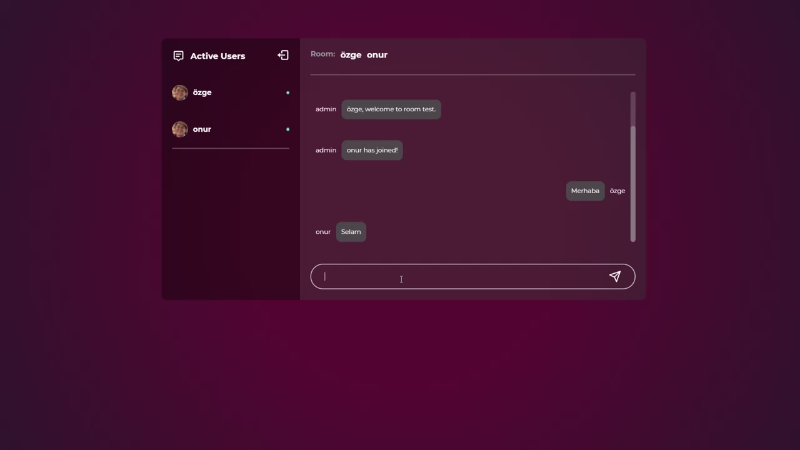
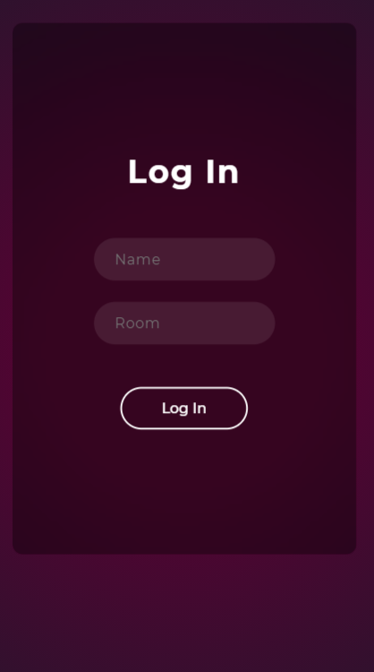
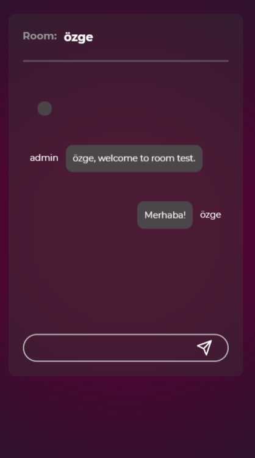

# 💬 WazzUp Chat | Kodluyoruz Proje Fabrikası

🌍 **Canlı URL | Live URL:** <a href="https://wazzupchat.netlify.app/" target="_blank">https://wazzupchat.netlify.app/</a>

## 🇹🇷 [README (TR)](#readme-tr)
## Genel Bakış
- [Proje Hakkında](#proje-hakkinda)
- [Proje İçeriği](#proje-icerigi)
- - [Kullanılan Teknolojiler](#kullanilan-teknolojiler)
- - [Ekran Görüntüleri](#ekran-goruntuleri)
- [Kurulum](#kurulum)
- [Kullanılan Kaynaklar](#kullanilan-kaynaklar)
- [Katkıda Bulunanlar](#katkida-bulunanlar)

## 🇬🇧 [README (EN)](#readme-en)
## Overview
- [About Project](#about-project)
- [Content of the Project](#content-of-the-project)
- - [Used Technologies](#used-technologies)
- - [Screenshots](#screenshots)
- [Installation](#installation)
- [Used Sources](#used-sources)
- [Contributors](#contributors)

## 🇹🇷 README (TR)<a name="readme-tr">
## ℹ Proje Hakkında <a name="proje-hakkinda">

[Kodluyoruz](https://www.kodluyoruz.org/)'un **Proje Fabrikası** etkinliği kapsamında **WhazzUp Chat** adlı bir sohbet uygulaması geliştirdik. Geliştirdiğimiz uygulama kullanıcılara bir sohbet odası sunar. Kullanıcılar adlarını ve girmek istedikleri odanın adını yazarak bir sohbet odasına bağlanabilirler ve aynı odadaki diğer kullanıcılarla mesajlaşabilirler. Kullanıcı sayfayı yenileyince veya sohbet odasından ayrılınca bütün mesajlar silinir.

## 📝 Proje İçeriği <a name="proje-icerigi">

###  Kullanılan Teknolojiler <a name="kullanilan-teknolojiler">

 

### 📸 Ekran Görüntüleri <a name="ekran-goruntuleri">

**Masaüstü ekran görüntüleri**

**Mobil ekran görüntüleri**

## 💻 Kurulum <a name="kurulum">

Projeyi çalıştırmak için bilgisayarınızda <a href="https://nodejs.org/en/" target="_blank">Node.JS</a> yüklü olmalıdır. Projeyi bilgisayarınıza indirdiğinizde önce sunucu (server-side) tarafını sonra istemci (client-side) tarafını çalıştırmanız gerekmektedir.

**Sunucu tarafının kurulumu için:**

1. Dosyayı indirdikten sonra komut satırını açarak dosyanın konumunu girin.
2. `cd server` yazarak `server` klasörüne erişin.
3. `npm start` yazarak sunucuyu ayağa kaldırın.

**İstemci tarafının kurulumu için:**

1. Sunucuyu ayağa kaldırdıktan sonra proje klasörünü kod editöründe açın.
2. Terminal kısmına `npm i` yazarak projenin *dependency*'lerini indirin.
3. `cd client` yazarak `client` klasörüne erişin.
4. `npm start` yazarak projeyi çalıştırın.

## 📚 Kullanılan Kaynaklar <a name="kullanilan-kaynaklar">

Bu uygulamanın sunucu tarafı oluştururken <a href="https://github.com/adrianhajdin/project_chat_application" target="_blank">buradaki</a> repository'den yararlandık.

## ✍ Katkıda Bulunanlar <a name="katkida-bulunanlar">

**Özge Demiryol**

**Onur Aylanç**

**Müzeyyen Nur Akçay**
  

Eğer proje hakkında bir öneriniz varsa veya herhangi bir sorun fark ettiyseniz lütfen bizimle iletişime geçiniz.

---

## 🇬🇧 README (EN) <a name="readme-en">

## ℹ About Project <a name="about-project">

We developed a chat app called **WhazzUp Chat** in the scope of **Project Factory** event of [Kodluyoruz](https://www.kodluyoruz.org/). The app we developed provides users a chat room. Users can connect a chat room by typing their name and room's name they want and chat with other users in the same room. All messages are deleted when user refreshes the page or leaves the chat room.

## 📝 Content of the Project <a name="content-of-the-project">

###  Used Technologies <a name="used-technologies">

 

### 📸 Screenshots <a name="screenshots">

**Desktop screenshots**

**Mobile screenshots**

  
## 💻 Installation <a name="installation">

<a href="https://nodejs.org/en/" target="_blank">Node.JS</a> must be installed on your computer to run this project. You need to run the server-side first and then need to run client-side when you download the file to your computer.

**For installation of the server-side:**

1. Type the project folder's path in command prompt after downloading the project.
2. Reach `server` folder by typing `cd server`.
3. Start the server by typing `npm start`.

**For installation of the client-side:**

1. After starting the server, open the project folder in your code editor.
2. Download all dependencies of the project by typing `npm i` in terminal.
3. Reach `client` folder by typing `cd client`.
4. Run the project by typing `npm start`.

## 📚 Used Sources <a name="used-sources">

We used <a href="https://github.com/adrianhajdin/project_chat_application" target="_blank">this repository</a> while creating the server-side of our project.

## ✍ Contributors <a name="contributors">

**Özge Demiryol**

**Onur Aylanç**

**Müzeyyen Nur Akçay**
  

Please contact us if you noticed any problems or have any suggestion about the project.
